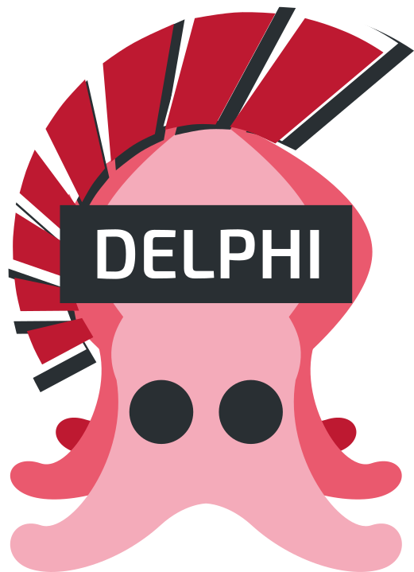

# sqids-delphi
Delphi port of Sqids. Generate short YouTube-looking IDs from numbers

<p align="center">
    <a href="https://sqids.org/"></a>
</p>

<h1 align="center">Sqids-Delphi</h1>
<p align="center">
	<a href="https://github.com/paolo-rossi/sqids-delphi/releases">
		
	</a>
	<a href="https://github.com/paolo-rossi/sqids-delphi/tree/main/Source">
		
	</a>
	<a href="LICENSE">
		
	</a>
</p>

## What is Sqids?
[Sqids](https://sqids.org/go) (*pronounced "squids"*)  is a small library that lets you generate YouTube-looking IDs from numbers. It's good for link shortening, fast & URL-safe ID generation and decoding back into numbers for quicker database lookups.

### Features

- **Encode multiple numbers** - generate short IDs from one or several non-negative numbers
- **Quick decoding** - easily decode IDs back into numbers
- **Unique IDs** - generate unique IDs by shuffling the alphabet once
- **ID padding** - provide minimum length to make IDs more uniform
- **URL safe** - auto-generated IDs do not contain common profanity
- **Randomized output** - Sequential input provides nonconsecutive IDs
- **Many implementations** - Support for [40+ programming languages](https://sqids.org/)


### Sqids use-cases

#### Good for:

:heavy_check_mark: Obfuscating plain ID for resources in REST development <br />
:heavy_check_mark: Generating IDs for public URLs (eg: link shortening)<br />
:heavy_check_mark: Generating IDs for internal systems (eg: event tracking)<br />
:heavy_check_mark: Decoding for quicker database lookups (eg: by primary keys)<br />

#### Not good for:

:x: Sensitive data (this is not an encryption library)<br />

---

## Getting Started with Sqids-Delphi

Installing Sqids-Delphi is very easy, just copy the Source folder anywhere in your disk, point the search path to it and... you are good to go!

```delphi
uses Sqids;
```

### Delphi versions compatibility

> **Disclaimer**: 
> I ported this library from the [sqids-go](https://github.com/sqids/sqids-go) project and I wanted to write the code using all the recent Delphi features in order see how expressive is the Delphi language compared to other languages (Go in this case). Turns out that the Delphi language expressiveness is pretty great compared to the likes of Go, C#, Java, etc... but only if you use the latest additions to the language (a.k.a. use a recent Delphi version).

In order to compile Sqids-Delphi (without modifications) you need a Delphi >= 10.3 (Rio) because I used extensively the inline var declaration feature (introduced precisely in Delphi 10.3).

Of course the porting to an earlier version of Delphi is pretty straightforward: move all the `var` declaration in the usual Pascal's declaration block.

The other "recent" feature that I used, is the new syntax for dynamic arrays introduced in Delphi XE7, even in this case you can easily convert this code using `SetLength()`.

## Usage:

All you need is an instance (well, not an instance because it's a record) of `TSqids`, which is responsible for both encoding and decoding.

Using the parameterless class function New() you can configure `TSqids` with the default options:

```delphi
uses Sqids.Classes;

var sqids := TSqids.New;
```

#### Single number:

```delphi
var id := sqids.EncodeSingle(1);      // 'UfB'
var number := sqids.DecodeSingle(id); // 1
```

#### Multiple numbers:

```delphi
var id := sqids.Encode([1, 2, 3]); // '8QRLaD'
var numbers := sqids.Decode(id);   // [1, 2, 3]
```

> **Note**
> Sqids also preserves the order when encoding/decoding multiple numbers.

## Customizations:

You can easily customize the alphabet (the characters that Sqids uses to encode the numbers), the minimum length of the IDs (how long the IDs should be at minimum), and the blocklist (the words that should not appear in the IDs), by passing an instance of `SqidsOptions` to the constructor of `SqidsEncoder`.

You can specify all the properties, and any you leave out will fall back to their default values.

#### Custom Alphabet:

You can give Sqids your own custom (ideally shuffled) alphabet to use in the IDs:

```delphi
var options := TSqidsOptions.Create('acd123efgzxy');

var sqids := TSqids.New(options);

var id := sqids.Encode([1, 2, 3]);   // '1x3gd2'
```

> **Note**
> It's recommended that you at least provide a shuffled alphabet when using Sqids - even if you want to use the same characters as those the default alphabet - so that your IDs will be unique to you.

#### Minimum Length:

By default, Sqids uses as few characters as possible to encode a given number. However, if you want all your IDs to be at least a certain length (e.g. for aesthetic reasons), you can configure this via the `MinLength` option:

```delphi
var options := TSqidsOptions.Create('acd123efgzxy', 5);

var sqids := TSqids.New(options);

var id := sqids.Encode([1]);   // 'cx13a'
```

#### Custom Blocklist:

Sqids comes with a large default blocklist which will ensure that common curse words and such never appear anywhere in your IDs. You can add extra items to this default blocklist like so:

```delphi
var options := TSqidsOptions.Create('acd123efgzxy', 5);
options.Blocklist := ['dont', 'use', 'these', 'words'];

var sqids := TSqids.New(options);

var id := sqids.Encode([1, 2, 3]);   // 'djhehd'
```

## Advanced Usage:

//todo

## License:

[MIT](LICENSE)
